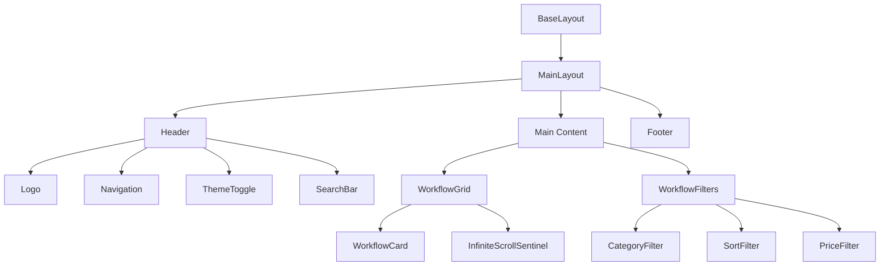
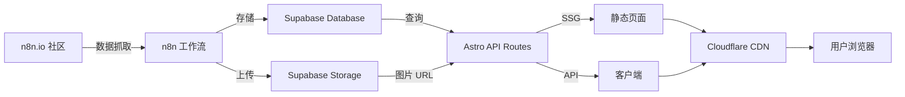

# N8N Workflows 网站架构设计文档

## 项目概述

N8N Workflows 是一个基于 Astro 构建的工作流展示平台，用于展示和分享 n8n 自动化工作流。本文档详细说明了项目的技术架构、目录结构、组件设计和实现规范。

**核心技术栈：**
- 前端框架：Astro v5.7.13
- 样式框架：Tailwind CSS
- 数据存储：Supabase
- 部署平台：Cloudflare Pages

---

## 1. 项目目录结构

```
n8nworkflows.xyz/
├── public/                          # 静态资源目录
│   ├── fonts/                       # 字体文件
│   │   ├── inter/                   # Inter 字体系列
│   │   └── jetbrains-mono/          # JetBrains Mono 字体
│   ├── images/                      # 图片资源
│   │   ├── logo.svg                 # 网站 Logo
│   │   ├── placeholder-workflow.webp # 工作流占位图
│   │   └── og-image.png             # Open Graph 图片
│   ├── favicon.ico                  # 网站图标
│   ├── robots.txt                   # 搜索引擎爬虫配置
│   └── sitemap.xml                  # 网站地图（构建时生成）
│
├── src/
│   ├── components/                  # 可复用组件
│   │   ├── common/                  # 通用组件
│   │   │   ├── Header.astro         # 网站头部导航
│   │   │   ├── Footer.astro         # 网站底部
│   │   │   ├── ThemeToggle.astro    # 主题切换按钮
│   │   │   ├── SearchBar.astro      # 搜索栏组件
│   │   │   └── Pagination.astro     # 分页组件
│   │   │
│   │   ├── workflow/                # 工作流相关组件
│   │   │   ├── WorkflowCard.astro   # 工作流卡片
│   │   │   ├── WorkflowGrid.astro   # 工作流网格容器
│   │   │   ├── WorkflowDetail.astro # 工作流详情页
│   │   │   ├── WorkflowFilters.astro # 筛选器组件
│   │   │   └── InfiniteScrollSentinel.astro # 无限滚动哨兵
│   │   │
│   │   ├── ui/                      # UI 组件
│   │   │   ├── Button.astro         # 按钮组件
│   │   │   ├── Badge.astro          # 徽章组件
│   │   │   ├── Card.astro           # 卡片组件
│   │   │   ├── Loading.astro        # 加载指示器
│   │   │   └── ErrorMessage.astro   # 错误消息组件
│   │   │
│   │   └── seo/                     # SEO 相关组件
│   │       ├── SEOHead.astro        # SEO Meta 标签
│   │       ├── SchemaOrg.astro      # Schema.org 结构化数据
│   │       └── OpenGraph.astro      # Open Graph 标签
│   │
│   ├── layouts/                     # 页面布局
│   │   ├── BaseLayout.astro         # 基础布局（包含 HTML 结构）
│   │   ├── MainLayout.astro         # 主布局（带 Header/Footer）
│   │   └── WorkflowLayout.astro     # 工作流详情页布局
│   │
│   ├── pages/                       # 页面路由
│   │   ├── index.astro              # 首页（所有工作流）
│   │   ├── popular.astro            # 热门工作流页
│   │   ├── recent.astro             # 最新工作流页
│   │   ├── about.astro              # 关于页面
│   │   │
│   │   ├── categories/              # 分类页面
│   │   │   ├── index.astro          # 分类列表页
│   │   │   └── [category].astro     # 动态分类页
│   │   │
│   │   ├── authors/                 # 作者页面
│   │   │   ├── index.astro          # 作者列表页
│   │   │   └── [author].astro       # 动态作者页
│   │   │
│   │   ├── complexity/              # 复杂度页面
│   │   │   ├── index.astro          # 复杂度列表页
│   │   │   └── [level].astro        # 动态复杂度页
│   │   │
│   │   ├── workflows/               # 工作流详情
│   │   │   └── [slug].astro         # 动态工作流详情页
│   │   │
│   │   ├── articles/                # 文章页面
│   │   │   ├── index.astro          # 文章列表页
│   │   │   └── [slug].astro         # 动态文章页
│   │   │
│   │   └── api/                     # API 端点
│   │       ├── load-more-workflows.json.ts  # 加载更多工作流
│   │       ├── search.json.ts       # 搜索 API
│   │       └── stats.json.ts        # 统计数据 API
│   │
│   ├── scripts/                     # 客户端脚本
│   │   ├── theme-toggle.ts          # 主题切换逻辑
│   │   ├── infinite-scroll.ts       # 无限滚动逻辑
│   │   ├── search.ts                # 搜索功能
│   │   ├── analytics.ts             # Google Analytics 集成
│   │   └── utils.ts                 # 工具函数
│   │
│   ├── styles/                      # 样式文件
│   │   ├── global.css               # 全局样式
│   │   ├── fonts.css                # 字体定义
│   │   └── themes.css               # 主题变量
│   │
│   ├── lib/                         # 工具库和服务
│   │   ├── supabase.ts              # Supabase 客户端配置
│   │   ├── api.ts                   # API 请求封装
│   │   ├── utils.ts                 # 通用工具函数
│   │   ├── constants.ts             # 常量定义
│   │   └── types.ts                 # TypeScript 类型定义
│   │
│   ├── data/                        # 静态数据
│   │   ├── categories.json          # 分类数据
│   │   ├── complexity-levels.json   # 复杂度级别
│   │   └── navigation.json          # 导航菜单配置
│   │
│   └── env.d.ts                     # 环境变量类型定义
│
├── .github/                         # GitHub 配置
│   └── workflows/                   # GitHub Actions
│       ├── deploy.yml               # 部署工作流
│       └── test.yml                 # 测试工作流
│
├── plans/                           # 项目规划文档
│   └── ARCHITECTURE.md              # 本架构文档
│
├── astro.config.mjs                 # Astro 配置文件
├── tailwind.config.js               # Tailwind CSS 配置
├── tsconfig.json                    # TypeScript 配置
├── package.json                     # 项目依赖
├── .env.example                     # 环境变量示例
├── .gitignore                       # Git 忽略文件
└── README.md                        # 项目说明文档
```

---

## 2. 技术栈与依赖清单

### 2.1 核心依赖

```json
{
  "dependencies": {
    "astro": "^5.7.13",
    "@astrojs/tailwind": "^5.1.3",
    "tailwindcss": "^3.4.17",
    "@supabase/supabase-js": "^2.39.0",
    "@n8n_io/n8n-demo-component": "^0.1.0",
    "@webcomponents/webcomponentsjs": "^2.8.0",
    "lit": "^3.1.0"
  }
}
```

### 2.2 开发依赖

```json
{
  "devDependencies": {
    "@types/node": "^20.10.0",
    "typescript": "^5.3.3",
    "@astrojs/sitemap": "^3.0.3",
    "@astrojs/rss": "^4.0.1",
    "prettier": "^3.1.0",
    "prettier-plugin-astro": "^0.12.2",
    "prettier-plugin-tailwindcss": "^0.5.9"
  }
}
```

### 2.3 字体依赖

- **Inter**: 用于正文和界面文本
  - 权重：400 (Regular), 500 (Medium), 600 (Semi-Bold), 700 (Bold), 900 (Black)
  - 来源：Google Fonts 或自托管

- **JetBrains Mono**: 用于代码和等宽文本
  - 权重：400 (Regular), 500 (Medium)
  - 来源：Google Fonts 或自托管

### 2.4 外部服务

- **Supabase**: 数据存储和图片托管
  - Database: PostgreSQL
  - Storage: 工作流截图存储
  - API: RESTful API

- **Cloudflare**: CDN 和部署
  - Pages: 静态站点托管
  - CDN: 全球内容分发
  - Analytics: 网站分析（可选）

- **Google Analytics**: 用户行为分析
  - GA4: 新版 Google Analytics

---

## 3. 配置文件详细说明

### 3.1 Astro 配置 (astro.config.mjs)

```javascript
import { defineConfig } from 'astro/config';
import tailwind from '@astrojs/tailwind';
import sitemap from '@astrojs/sitemap';

export default defineConfig({
  // 网站 URL
  site: 'https://n8nworkflow.com',
  
  // 集成
  integrations: [
    tailwind({
      // 应用基础样式
      applyBaseStyles: false,
    }),
    sitemap({
      // 自动生成站点地图
      filter: (page) => !page.includes('/api/'),
      changefreq: 'daily',
      priority: 0.7,
    }),
  ],
  
  // 输出配置
  output: 'static',
  
  // 构建配置
  build: {
    // 内联样式表小于此大小（字节）
    inlineStylesheets: 'auto',
  },
  
  // Vite 配置
  vite: {
    // 优化依赖
    optimizeDeps: {
      include: ['@supabase/supabase-js'],
    },
  },
  
  // 图片优化
  image: {
    domains: ['supabase.amastuces.com'],
    remotePatterns: [
      {
        protocol: 'https',
        hostname: 'supabase.amastuces.com',
      },
    ],
  },
  
  // Markdown 配置
  markdown: {
    shikiConfig: {
      theme: 'github-dark',
      wrap: true,
    },
  },
});
```

### 3.2 Tailwind CSS 配置 (tailwind.config.js)

```javascript
/** @type {import('tailwindcss').Config} */
export default {
  content: [
    './src/**/*.{astro,html,js,jsx,md,mdx,svelte,ts,tsx,vue}',
  ],
  
  // 暗色模式配置
  darkMode: 'class',
  
  theme: {
    extend: {
      // 自定义颜色
      colors: {
        primary: {
          50: '#FFF5F3',
          100: '#FFE8E5',
          200: '#FFD5CF',
          300: '#FFB8AD',
          400: '#FF7A6D',
          500: '#FF5E4D',
          600: '#FF5E4D',
          700: '#E63E2E',
          800: '#C02819',
          900: '#9F1F13',
        },
        secondary: {
          50: '#FFFBF0',
          100: '#FFF7E0',
          200: '#FFEFC2',
          300: '#FFE799',
          400: '#FFD447',
          500: '#FFD447',
          600: '#F6C000',
          700: '#D4A000',
          800: '#B38600',
          900: '#8F6A00',
        },
        neutral: {
          50: '#F9FAFB',
          100: '#F3F4F6',
          200: '#E5E7EB',
          300: '#D1D5DB',
          400: '#9CA3AF',
          500: '#6B7280',
          600: '#4B5563',
          700: '#374151',
          800: '#1F2937',
          900: '#111827',
        },
      },
      
      // 字体家族
      fontFamily: {
        sans: ['Inter', 'system-ui', 'sans-serif'],
        mono: ['JetBrains Mono', 'Consolas', 'monospace'],
      },
      
      // 间距
      spacing: {
        '18': '4.5rem',
        '88': '22rem',
        '128': '32rem',
      },
      
      // 容器
      container: {
        center: true,
        padding: {
          DEFAULT: '1rem',
          sm: '2rem',
          lg: '4rem',
          xl: '5rem',
          '2xl': '6rem',
        },
      },
      
      // 动画
      animation: {
        'fade-in': 'fadeIn 0.3s ease-in-out',
        'slide-up': 'slideUp 0.3s ease-out',
        'pulse-slow': 'pulse 3s cubic-bezier(0.4, 0, 0.6, 1) infinite',
      },
      
      keyframes: {
        fadeIn: {
          '0%': { opacity: '0' },
          '100%': { opacity: '1' },
        },
        slideUp: {
          '0%': { transform: 'translateY(10px)', opacity: '0' },
          '100%': { transform: 'translateY(0)', opacity: '1' },
        },
      },
      
      // 阴影
      boxShadow: {
        'card': '0 1px 3px 0 rgba(0, 0, 0, 0.1), 0 1px 2px 0 rgba(0, 0, 0, 0.06)',
        'card-hover': '0 10px 15px -3px rgba(0, 0, 0, 0.1), 0 4px 6px -2px rgba(0, 0, 0, 0.05)',
      },
    },
  },
  
  plugins: [
    // 可选插件
    // require('@tailwindcss/forms'),
    // require('@tailwindcss/typography'),
  ],
};
```

### 3.3 TypeScript 配置 (tsconfig.json)

```json
{
  "extends": "astro/tsconfigs/strict",
  "compilerOptions": {
    "target": "ES2022",
    "module": "ESNext",
    "moduleResolution": "bundler",
    "lib": ["ES2022", "DOM", "DOM.Iterable"],
    "jsx": "react-jsx",
    "jsxImportSource": "astro",
    "strict": true,
    "esModuleInterop": true,
    "skipLibCheck": true,
    "forceConsistentCasingInFileNames": true,
    "resolveJsonModule": true,
    "isolatedModules": true,
    "baseUrl": ".",
    "paths": {
      "@/*": ["./src/*"],
      "@components/*": ["./src/components/*"],
      "@layouts/*": ["./src/layouts/*"],
      "@lib/*": ["./src/lib/*"],
      "@styles/*": ["./src/styles/*"],
      "@scripts/*": ["./src/scripts/*"]
    }
  },
  "include": ["src/**/*"],
  "exclude": ["node_modules", "dist"]
}
```

### 3.4 环境变量配置 (.env.example)

```bash
# Supabase 配置
PUBLIC_SUPABASE_URL=https://your-project.supabase.co
PUBLIC_SUPABASE_ANON_KEY=your-anon-key
SUPABASE_SERVICE_ROLE_KEY=your-service-role-key

# 网站配置
PUBLIC_SITE_URL=https://n8nworkflow.com
PUBLIC_SITE_NAME=N8N Workflows

# Google Analytics
PUBLIC_GA_MEASUREMENT_ID=G-XXXXXXXXXX

# API 配置
API_BASE_URL=https://n8nworkflow.com/api

# 功能开关
ENABLE_ANALYTICS=true
ENABLE_SEARCH=true
```

---

## 4. 组件架构设计

### 4.1 组件层次结构



### 4.2 核心组件说明

#### 4.2.1 BaseLayout.astro

**职责：** 提供基础 HTML 结构和全局配置

**接口：**
```typescript
interface Props {
  title: string;
  description: string;
  image?: string;
  canonical?: string;
  noindex?: boolean;
}
```

**功能：**
- HTML 文档结构
- Meta 标签配置
- 全局样式引入
- 字体加载
- Analytics 脚本

#### 4.2.2 Header.astro

**职责：** 网站顶部导航栏

**接口：**
```typescript
interface Props {
  currentPath?: string;
}
```

**功能：**
- Logo 展示
- 导航菜单（Popular, Recent, Categories, Authors, Complexity, About）
- 主题切换按钮
- 搜索栏（可选）
- 响应式菜单（移动端）

#### 4.2.3 WorkflowCard.astro

**职责：** 单个工作流卡片展示

**接口：**
```typescript
interface Props {
  workflow: {
    id: number;
    slug: string;
    title: string;
    description: string;
    thumbnail: string;
    author: {
      name: string;
      avatar?: string;
    };
    categories: string[];
    complexityLevel: 'beginner' | 'intermediate' | 'advanced';
    price: number;
    date: string;
    visitors: number;
    downloads: number;
  };
  lazy?: boolean;
}
```

**功能：**
- 工作流缩略图展示
- 标题和描述
- 作者信息
- 分类标签
- 复杂度徽章
- 价格标识（Free/Paid）
- 统计信息（日期、浏览量、下载量）
- 悬停效果

#### 4.2.4 WorkflowGrid.astro

**职责：** 工作流网格容器

**接口：**
```typescript
interface Props {
  workflows: Workflow[];
  columns?: 1 | 2 | 3 | 4;
}
```

**功能：**
- 响应式网格布局
- 工作流卡片渲染
- 空状态处理

#### 4.2.5 InfiniteScrollSentinel.astro

**职责：** 无限滚动触发器

**接口：**
```typescript
interface Props {
  loadMoreUrl: string;
  totalCount: number;
  initialOffset: number;
}
```

**功能：**
- Intersection Observer 监听
- 加载状态显示
- 错误处理
- 无更多数据提示

#### 4.2.6 ThemeToggle.astro

**职责：** 明暗主题切换

**功能：**
- 主题状态管理
- LocalStorage 持久化
- 系统主题检测
- 平滑过渡动画

#### 4.2.7 SEOHead.astro

**职责：** SEO Meta 标签管理

**接口：**
```typescript
interface Props {
  title: string;
  description: string;
  canonical?: string;
  image?: string;
  type?: 'website' | 'article';
  publishedTime?: string;
  modifiedTime?: string;
  author?: string;
  tags?: string[];
}
```

**功能：**
- 基础 Meta 标签
- Open Graph 标签
- Twitter Card 标签
- Canonical URL
- 结构化数据（JSON-LD）

---

## 5. 数据流设计

### 5.1 数据流架构图



### 5.2 数据模型

#### 5.2.1 Workflow 数据结构

```typescript
interface Workflow {
  // 基础信息
  id: number;
  slug: string;
  title: string;
  description: string;
  
  // 媒体资源
  thumbnail: string;
  screenshots?: string[];
  
  // 作者信息
  author: {
    id: number;
    name: string;
    avatar?: string;
    bio?: string;
  };
  
  // 分类和标签
  categories: string[];
  tags?: string[];
  
  // 复杂度和定价
  complexityLevel: 'beginner' | 'intermediate' | 'advanced';
  price: number; // 0 表示免费
  
  // 统计数据
  visitors: number;
  downloads: number;
  likes?: number;
  
  // 时间戳
  createdAt: string;
  updatedAt: string;
  publishedAt: string;
  
  // SEO
  metaTitle?: string;
  metaDescription?: string;
  
  // 工作流详情
  nodes?: number; // 节点数量
  version?: string; // n8n 版本
  sourceUrl?: string; // 原始链接
}
```

#### 5.2.2 Category 数据结构

```typescript
interface Category {
  id: number;
  slug: string;
  name: string;
  description?: string;
  icon?: string;
  color?: string;
  workflowCount: number;
}
```

#### 5.2.3 Author 数据结构

```typescript
interface Author {
  id: number;
  slug: string;
  name: string;
  avatar?: string;
  bio?: string;
  website?: string;
  twitter?: string;
  github?: string;
  workflowCount: number;
}
```

### 5.3 数据获取策略

#### 5.3.1 静态生成（SSG）

**适用页面：**
- 首页（前 12 个工作流）
- 分类列表页
- 作者列表页
- 复杂度列表页
- 关于页面

**优势：**
- 极快的加载速度
- 优秀的 SEO 表现
- 降低服务器负载

#### 5.3.2 客户端渲染（CSR）

**适用场景：**
- 无限滚动加载
- 搜索结果
- 实时筛选

**实现方式：**
- Fetch API
- Intersection Observer
- 状态管理

#### 5.3.3 混合策略

**首页加载流程：**
1. SSG 生成初始 12 个工作流
2. 客户端 Intersection Observer 监听滚动
3. 触发时调用 API 加载更多
4. 动态插入到 DOM

---

## 6. API 接口设计

### 6.1 API 端点规范

#### 6.1.1 加载更多工作流

**端点：** `GET /api/load-more-workflows.json`

**查询参数：**
```typescript
interface LoadMoreParams {
  type?: 'all' | 'popular' | 'recent';
  category?: string;
  author?: string;
  complexity?: 'beginner' | 'intermediate' | 'advanced';
  sort?: 'date-desc' | 'date-asc' | 'visitors-desc' | 'downloads-desc';
  price?: 'all' | 'free' | 'paid';
  offset: number;
  limit: number;
}
```

**响应格式：**
```typescript
interface LoadMoreResponse {
  workflows: Workflow[];
  total: number;
  offset: number;
  limit: number;
  hasMore: boolean;
}
```

**示例请求：**
```
GET /api/load-more-workflows.json?type=all&sort=date-desc&offset=12&limit=10
```

**示例响应：**
```json
{
  "workflows": [
    {
      "id": 12399,
      "slug": "email-reports-on-expiring-microsoft-entra-id",
      "title": "Email reports on expiring Microsoft Entra ID",
      "description": "Automate Entra ID secret/cert expiry monitoring",
      "thumbnail": "https://supabase.amastuces.com/storage/v1/...",
      "author": {
        "name": "Alexander Schnabl"
      },
      "categories": ["DevOps"],
      "complexityLevel": "advanced",
      "price": 0,
      "createdAt": "2026-01-02T00:00:00Z",
      "visitors": 24,
      "downloads": 8
    }
  ],
  "total": 7943,
  "offset": 12,
  "limit": 10,
  "hasMore": true
}
```

#### 6.1.2 搜索工作流

**端点：** `GET /api/search.json`

**查询参数：**
```typescript
interface SearchParams {
  q: string; // 搜索关键词
  category?: string;
  complexity?: string;
  price?: 'all' | 'free' | 'paid';
  offset?: number;
  limit?: number;
}
```

**响应格式：**
```typescript
interface SearchResponse {
  results: Workflow[];
  total: number;
  query: string;
}
```

#### 6.1.3 统计数据

**端点：** `GET /api/stats.json`

**响应格式：**
```typescript
interface StatsResponse {
  totalWorkflows: number;
  totalAuthors: number;
  totalCategories: number;
  totalDownloads: number;
  recentWorkflows: number; // 最近 30 天
}
```

### 6.2 Supabase 数据库查询

#### 6.2.1 获取工作流列表

```typescript
// src/lib/api.ts
import { supabase } from './supabase';

export async function getWorkflows(params: {
  offset?: number;
  limit?: number;
  category?: string;
  complexity?: string;
  sortBy?: string;
}) {
  let query = supabase
    .from('workflows')
    .select(`
      *,
      author:authors(*),
      categories:workflow_categories(category:categories(*))
    `);
  
  // 筛选条件
  if (params.category) {
    query = query.eq('categories.slug', params.category);
  }
  
  if (params.complexity) {
    query = query.eq('complexityLevel', params.complexity);
  }
  
  // 排序
  if (params.sortBy === 'date-desc') {
    query = query.order('publishedAt', { ascending: false });
  } else if (params.sortBy === 'visitors-desc') {
    query = query.order('visitors', { ascending: false });
  }
  
  // 分页
  query = query.range(
    params.offset || 0,
    (params.offset || 0) + (params.limit || 10) - 1
  );
  
  const { data, error, count } = await query;
  
  if (error) throw error;
  
  return {
    workflows: data || [],
    total: count || 0,
  };
}
```

#### 6.2.2 Supabase 客户端配置

```typescript
// src/lib/supabase.ts
import { createClient } from '@supabase/supabase-js';

const supabaseUrl = import.meta.env.PUBLIC_SUPABASE_URL;
const supabaseAnonKey = import.meta.env.PUBLIC_SUPABASE_ANON_KEY;

if (!supabaseUrl || !supabaseAnonKey) {
  throw new Error('Missing Supabase environment variables');
}

export const supabase = createClient(supabaseUrl, supabaseAnonKey, {
  auth: {
    persistSession: false,
  },
});
```

---

## 7. 客户端脚本设计

### 7.1 主题切换脚本 (theme-toggle.ts)

```typescript
// src/scripts/theme-toggle.ts

type Theme = 'light' | 'dark';

class ThemeManager {
  private readonly STORAGE_KEY = 'theme';
  private currentTheme: Theme;

  constructor() {
    this.currentTheme = this.getInitialTheme();
    this.applyTheme(this.currentTheme);
    this.setupEventListeners();
  }

  private getInitialTheme(): Theme {
    // 1. 检查 localStorage
    const stored = localStorage.getItem(this.STORAGE_KEY) as Theme | null;
    if (stored) return stored;

    // 2. 检查系统偏好
    if (window.matchMedia('(prefers-color-scheme: dark)').matches) {
      return 'dark';
    }

    return 'light';
  }

  private applyTheme(theme: Theme): void {
    const html = document.documentElement;
    const lightIcon = document.getElementById('theme-toggle-light-icon');
    const darkIcon = document.getElementById('theme-toggle-dark-icon');

    if (theme === 'dark') {
      html.classList.add('dark');
      lightIcon?.classList.add('hidden');
      darkIcon?.classList.remove('hidden');
    } else {
      html.classList.remove('dark');
      lightIcon?.classList.remove('hidden');
      darkIcon?.classList.add('hidden');
    }

    localStorage.setItem(this.STORAGE_KEY, theme);
    this.currentTheme = theme;
  }

  private toggleTheme(): void {
    const newTheme: Theme = this.currentTheme === 'dark' ? 'light' : 'dark';
    this.applyTheme(newTheme);
  }

  private setupEventListeners(): void {
    const toggleButton = document.getElementById('theme-toggle');
    toggleButton?.addEventListener('click', () => this.toggleTheme());

    // 监听系统主题变化
    window.matchMedia('(prefers-color-scheme: dark)').addEventListener('change', (e) => {
      if (!localStorage.getItem(this.STORAGE_KEY)) {
        this.applyTheme(e.matches ? 'dark' : 'light');
      }
    });
  }
}

// 初始化
document.addEventListener('DOMContentLoaded', () => {
  new ThemeManager();
});
```

### 7.2 无限滚动脚本 (infinite-scroll.ts)

```typescript
// src/scripts/infinite-scroll.ts

interface WorkflowData {
  workflows: any[];
  total: number;
  hasMore: boolean;
}

class InfiniteScroll {
  private sentinel: HTMLElement | null;
  private gridContainer: HTMLElement | null;
  private statusContainer: HTMLElement | null;
  private observer: IntersectionObserver | null = null;
  
  private currentOffset: number;
  private isLoading = false;
  private allLoaded = false;
  private totalCount: number;
  private loadMoreUrl: string;

  constructor() {
    this.sentinel = document.getElementById('infinite-scroll-sentinel');
    this.gridContainer = document.getElementById('workflows-grid');
    this.statusContainer = document.getElementById('infinite-scroll-status');
    
    if (!this.sentinel || !this.gridContainer) {
      console.warn('Infinite scroll elements not found');
      return;
    }

    this.currentOffset = this.gridContainer.children.length;
    this.totalCount = parseInt(this.sentinel.dataset.total || '0', 10);
    this.loadMoreUrl = this.sentinel.dataset.url || '';

    this.setupObserver();
    this.setupScrollFallback();
  }

  private setupObserver(): void {
    this.observer = new IntersectionObserver(
      (entries) => {
        if (entries[0].isIntersecting && !this.isLoading && !this.allLoaded) {
          this.loadMore();
        }
      },
      { rootMargin: '500px' }
    );

    if (this.sentinel) {
      this.observer.observe(this.sentinel);
    }
  }

  private setupScrollFallback(): void {
    window.addEventListener('scroll', () => {
      const scrollPosition = window.scrollY + window.innerHeight;
      const pageHeight = document.body.scrollHeight;
      
      if (scrollPosition / pageHeight > 0.8 && !this.isLoading && !this.allLoaded) {
        this.loadMore();
      }
    });
  }

  private async loadMore(): Promise<void> {
    if (this.isLoading || this.allLoaded || this.currentOffset >= this.totalCount) {
      return;
    }

    this.isLoading = true;
    this.showLoading();

    try {
      const url = `${this.loadMoreUrl}&offset=${this.currentOffset}&limit=10`;
      const response = await fetch(url);
      
      if (!response.ok) {
        throw new Error(`HTTP error! status: ${response.status}`);
      }

      const data: WorkflowData = await response.json();

      if (data.workflows && data.workflows.length > 0) {
        this.appendWorkflows(data.workflows);
        this.currentOffset += data.workflows.length;
      } else {
        this.showNoMore();
      }

      if (!data.hasMore) {
        this.showNoMore();
      }
    } catch (error) {
      console.error('Error loading workflows:', error);
      this.showError();
    } finally {
      this.isLoading = false;
      this.hideLoading();
    }
  }

  private appendWorkflows(workflows: any[]): void {
    if (!this.gridContainer) return;

    workflows.forEach((workflow) => {
      const card = this.createWorkflowCard(workflow);
      this.gridContainer!.appendChild(card);
    });
  }

  private createWorkflowCard(workflow: any): HTMLElement {
    // 创建工作流卡片 DOM
    const card = document.createElement('a');
    card.href = `/workflows/${workflow.slug}`;
    card.className = 'group';
    card.innerHTML = `
      <div class="flex flex-col overflow-hidden rounded-lg shadow-sm border border-gray-200 hover:shadow-md transition-shadow duration-300 bg-white dark:bg-gray-800 dark:border-gray-700 h-full">
        <div class="aspect-video bg-gray-100 dark:bg-gray-700 overflow-hidden relative">
          
          <span class="absolute top-2 right-2 text-xs px-2 py-1 rounded-full whitespace-nowrap shadow-sm font-medium"
                style="background-color: ${workflow.price ? 'rgba(255, 212, 71, 0.5)' : 'rgba(255, 94, 77, 0.5)'}; color: ${workflow.price ? 'black' : 'white'};">
            ${workflow.price ? 'Paid' : 'Free'}
          </span>
          <span class="absolute bottom-2 right-2 text-xs px-2 py-1 rounded-full bg-red-100 text-red-800 dark:bg-red-900 dark:text-red-200 whitespace-nowrap shadow-sm">
            ${workflow.complexityLevel}
          </span>
        </div>
        <div class="flex flex-col p-4 flex-1">
          <div class="mb-2">
            <h3 class="text-lg font-black text-gray-900 dark:text-white break-words">${workflow.title}</h3>
          </div>
          <p class="text-sm text-gray-600 dark:text-gray-300 mb-4 flex-1">${workflow.description}</p>
          <div class="mt-auto pt-2 border-t border-gray-100 dark:border-gray-700 text-xs text-gray-500 dark:text-gray-400">
            <div class="flex justify-center items-center gap-4 mb-2 mt-2">
              <div class="flex items-center text-xs text-gray-600 dark:text-gray-300">
                <svg class="h-3.5 w-3.5 mr-1.5 text-primary" fill="none" viewBox="0 0 24 24" stroke="currentColor">
                  <path stroke-linecap="round" stroke-linejoin="round" stroke-width="2" d="M16 7a4 4 0 11-8 0 4 4 0 018 0zM12 14a7 7 0 00-7 7h14a7 7 0 00-7-7z" />
                </svg>
                <span>${workflow.author?.name || 'Anonymous'}</span>
              </div>
            </div>
            <div class="flex justify-center items-center gap-8 mt-1">
              <div class="flex items-center">
                <svg class="h-3.5 w-3.5 mr-1.5 text-primary" fill="none" viewBox="0 0 24 24" stroke="currentColor">
                  <path stroke-linecap="round" stroke-linejoin="round" stroke-width="2" d="M8 7V3m8 4V3m-9 8h10M5 21h14a2 2 0 002-2V7a2 2 0 00-2-2H5a2 2 0 00-2 2v12a2 2 0 002 2z" />
                </svg>
                <span>${workflow.date}</span>
              </div>
              <div class="flex items-center">
                <svg class="h-3.5 w-3.5 mr-1.5 text-primary" fill="none" viewBox="0 0 24 24" stroke="currentColor">
                  <path stroke-linecap="round" stroke-linejoin="round" stroke-width="2" d="M15 12a3 3 0 11-6 0 3 3 0 016 0z" />
                  <path stroke-linecap="round" stroke-linejoin="round" stroke-width="2" d="M2.458 12C3.732 7.943 7.523 5 12 5c4.478 0 8.268 2.943 9.542 7-1.274 4.057-5.064 7-9.542 7-4.477 0-8.268-2.943-9.542-7z" />
                </svg>
                <span>${workflow.visitors || 0}</span>
              </div>
              <div class="flex items-center">
                <svg class="h-3.5 w-3.5 mr-1.5 text-primary" fill="none" viewBox="0 0 24 24" stroke="currentColor">
                  <path stroke-linecap="round" stroke-linejoin="round" stroke-width="2" d="M4 16v1a3 3 0 003 3h10a3 3 0 003-3v-1m-4-4l-4 4m0 0l-4-4m4 4V4" />
                </svg>
                <span>${workflow.downloads || 0}</span>
              </div>
            </div>
          </div>
        </div>
      </div>
    `;
    return card;
  }

  private showLoading(): void {
    this.statusContainer?.querySelector('.loading')?.classList.remove('hidden');
  }

  private hideLoading(): void {
    this.statusContainer?.querySelector('.loading')?.classList.add('hidden');
  }

  private showNoMore(): void {
    this.statusContainer?.querySelector('.no-more')?.classList.remove('hidden');
    this.allLoaded = true;
    if (this.observer && this.sentinel) {
      this.observer.unobserve(this.sentinel);
    }
  }

  private showError(): void {
    this.statusContainer?.querySelector('.error')?.classList.remove('hidden');
  }
}

// 初始化
document.addEventListener('DOMContentLoaded', () => {
  new InfiniteScroll();
});
```

---

## 8. 性能优化策略

### 8.1 图片优化

**策略：**
- 使用 WebP 格式
- 实现懒加载（loading="lazy"）
- 响应式图片（srcset）
- 占位图处理
- CDN 加速

**实现：**
```astro

```

### 8.2 代码分割

**策略：**
- 按路由分割代码
- 动态导入非关键组件
- 延迟加载第三方脚本

**实现：**
```typescript
// 动态导入
const SearchComponent = () => import('@components/SearchBar.astro');
```

### 8.3 缓存策略

**静态资源缓存：**
```
Cache-Control: public, max-age=31536000, immutable
```

**API 响应缓存：**
```
Cache-Control: public, max-age=300, s-maxage=600
```

### 8.4 CSS 优化

**策略：**
- 使用 Tailwind CSS 的 JIT 模式
- 移除未使用的 CSS
- 内联关键 CSS
- 压缩 CSS 文件

### 8.5 JavaScript 优化

**策略：**
- 最小化 JavaScript 包大小
- 使用原生 JavaScript 替代大型库
- Tree-shaking 移除未使用代码
- 压缩和混淆

---

## 9. SEO 优化策略

### 9.1 Meta 标签

**基础 Meta 标签：**
```html
<meta charset="UTF-8">
<meta name="viewport" content="width=device-width, initial-scale=1.0">
<meta name="description" content="...">
<meta name="keywords" content="n8n, workflows, automation">
<meta name="author" content="N8N Workflows">
<link rel="canonical" href="https://n8nworkflow.com/">
```

### 9.2 Open Graph 标签

```html
<meta property="og:type" content="website">
<meta property="og:url" content="https://n8nworkflow.com/">
<meta property="og:title" content="N8N Workflows">
<meta property="og:description" content="...">
<meta property="og:image" content="https://n8nworkflow.com/og-image.png">
```

### 9.3 结构化数据 (Schema.org)

```json
{
  "@context": "https://schema.org",
  "@type": "WebSite",
  "name": "N8N Workflows",
  "url": "https://n8nworkflow.com",
  "description": "Discover and share n8n automation workflows",
  "potentialAction": {
    "@type": "SearchAction",
    "target": "https://n8nworkflow.com/search?q={search_term_string}",
    "query-input": "required name=search_term_string"
  }
}
```

### 9.4 Sitemap 生成

使用 `@astrojs/sitemap` 自动生成站点地图：

```javascript
// astro.config.mjs
import sitemap from '@astrojs/sitemap';

export default defineConfig({
  site: 'https://n8nworkflow.com',
  integrations: [
    sitemap({
      filter: (page) => !page.includes('/api/'),
      changefreq: 'daily',
      priority: 0.7,
    }),
  ],
});
```

### 9.5 Robots.txt

```
User-agent: *
Allow: /
Disallow: /api/

Sitemap: https://n8nworkflow.com/sitemap.xml
```

---

## 10. 部署策略

### 10.1 Cloudflare Pages 部署

**构建配置：**
```yaml
# Build settings
Build command: npm run build
Build output directory: dist
Root directory: /
Node version: 18
```

**环境变量：**
- `PUBLIC_SUPABASE_URL`
- `PUBLIC_SUPABASE_ANON_KEY`
- `PUBLIC_GA_MEASUREMENT_ID`

### 10.2 CI/CD 流程

**GitHub Actions 工作流：**

```yaml
# .github/workflows/deploy.yml
name: Deploy to Cloudflare Pages

on:
  push:
    branches: [main]
  pull_request:
    branches: [main]

jobs:
  deploy:
    runs-on: ubuntu-latest
    steps:
      - uses: actions/checkout@v3
      
      - name: Setup Node.js
        uses: actions/setup-node@v3
        with:
          node-version: '18'
          cache: 'npm'
      
      - name: Install dependencies
        run: npm ci
      
      - name: Build
        run: npm run build
        env:
          PUBLIC_SUPABASE_URL: ${{ secrets.PUBLIC_SUPABASE_URL }}
          PUBLIC_SUPABASE_ANON_KEY: ${{ secrets.PUBLIC_SUPABASE_ANON_KEY }}
      
      - name: Deploy to Cloudflare Pages
        uses: cloudflare/pages-action@v1
        with:
          apiToken: ${{ secrets.CLOUDFLARE_API_TOKEN }}
          accountId: ${{ secrets.CLOUDFLARE_ACCOUNT_ID }}
          projectName: n8nworkflows
          directory: dist
          gitHubToken: ${{ secrets.GITHUB_TOKEN }}
```

### 10.3 性能监控

**工具：**
- Cloudflare Analytics
- Google Analytics 4
- Lighthouse CI
- Web Vitals

**关键指标：**
- LCP (Largest Contentful Paint) < 2.5s
- FID (First Input Delay) < 100ms
- CLS (Cumulative Layout Shift) < 0.1
- TTFB (Time to First Byte) < 600ms

---

## 11. 安全考虑

### 11.1 环境变量管理

- 使用 `.env` 文件存储敏感信息
- 不提交 `.env` 到版本控制
- 使用 `PUBLIC_` 前缀区分公开和私密变量

### 11.2 API 安全

- 使用 Supabase Row Level Security (RLS)
- 限制 API 请求频率
- 验证和清理用户输入
- CORS 配置

### 11.3 内容安全策略 (CSP)

```html
<meta http-equiv="Content-Security-Policy"
      content="default-src 'self';
               script-src 'self' 'unsafe-inline' https://www.googletagmanager.com;
               style-src 'self' 'unsafe-inline';
               img-src 'self' data: https://supabase.amastuces.com;
               font-src 'self' data:;">
```

---

## 12. 开发工作流

### 12.1 本地开发

```bash
# 安装依赖
npm install

# 启动开发服务器
npm run dev

# 构建生产版本
npm run build

# 预览生产构建
npm run preview
```

### 12.2 代码规范

**Prettier 配置：**
```json
{
  "semi": true,
  "singleQuote": true,
  "tabWidth": 2,
  "trailingComma": "es5",
  "printWidth": 100,
  "plugins": ["prettier-plugin-astro", "prettier-plugin-tailwindcss"]
}
```

### 12.3 Git 工作流

**分支策略：**
- `main`: 生产分支
- `develop`: 开发分支
- `feature/*`: 功能分支
- `fix/*`: 修复分支

**提交规范：**
```
feat: 添加新功能
fix: 修复 bug
docs: 文档更新
style: 代码格式调整
refactor: 代码重构
perf: 性能优化
test: 测试相关
chore: 构建/工具链更新
```

---

## 13. 项目里程碑

### 阶段 1: 基础架构搭建
- [ ] 初始化 Astro 项目
- [ ] 配置 Tailwind CSS
- [ ] 设置 TypeScript
- [ ] 配置 Supabase 连接
- [ ] 创建基础布局组件

### 阶段 2: 核心功能开发
- [ ] 实现工作流卡片组件
- [ ] 实现工作流网格布局
- [ ] 实现无限滚动功能
- [ ] 实现主题切换功能
- [ ] 创建 API 端点

### 阶段 3: 页面开发
- [ ] 首页开发
- [ ] 分类页面开发
- [ ] 作者页面开发
- [ ] 工作流详情页开发
- [ ] 关于页面开发

### 阶段 4: 优化与测试
- [ ] SEO 优化
- [ ] 性能优化
- [ ] 响应式测试
- [ ] 浏览器兼容性测试
- [ ] 可访问性测试

### 阶段 5: 部署上线
- [ ] 配置 Cloudflare Pages
- [ ] 设置 CI/CD 流程
- [ ] 配置域名和 SSL
- [ ] 性能监控设置
- [ ] 正式上线

---

## 14. 技术决策记录

### 14.1 为什么选择 Astro？

**优势：**
- 零 JavaScript 默认输出，极致性能
- 支持多种前端框架（React, Vue, Svelte）
- 优秀的 SEO 表现
- 简单的文件路由系统
- 内置图片优化

### 14.2 为什么选择 Tailwind CSS？

**优势：**
- 实用优先的设计方法
- 高度可定制
- 优秀的开发体验
- 自动移除未使用的 CSS
- 内置响应式设计

### 14.3 为什么选择 Supabase？

**优势：**
- 开源的 Firebase 替代品
- PostgreSQL 数据库
- 实时订阅功能
- 内置认证和存储
- 优秀的开发者体验

### 14.4 为什么选择 Cloudflare Pages？

**优势：**
- 全球 CDN 网络
- 无限带宽
- 自动 HTTPS
- 与 GitHub 集成
- 优秀的性能

---

## 15. 附录

### 15.1 有用的资源

**官方文档：**
- [Astro 文档](https://docs.astro.build/)
- [Tailwind CSS 文档](https://tailwindcss.com/docs)
- [Supabase 文档](https://supabase.com/docs)
- [Cloudflare Pages 文档](https://developers.cloudflare.com/pages/)

**社区资源：**
- [Astro Discord](https://astro.build/chat)
- [n8n 社区](https://community.n8n.io/)
- [Tailwind CSS Discord](https://tailwindcss.com/discord)

### 15.2 常见问题

**Q: 如何处理大量工作流数据？**
A: 使用无限滚动和分页，初始只加载 12 个工作流，按需加载更多。

**Q: 如何优化图片加载？**
A: 使用 WebP 格式、懒加载、CDN 加速和占位图。

**Q: 如何实现主题切换？**
A: 使用 Tailwind 的 dark mode 类和 localStorage 持久化。

**Q: 如何提高 SEO 表现？**
A: 使用 SSG、完整的 Meta 标签、结构化数据和 Sitemap。

### 15.3 术语表

- **SSG**: Static Site Generation（静态站点生成）
- **CSR**: Client-Side Rendering（客户端渲染）
- **CDN**: Content Delivery Network（内容分发网络）
- **SEO**: Search Engine Optimization（搜索引擎优化）
- **RLS**: Row Level Security（行级安全）
- **LCP**: Largest Contentful Paint（最大内容绘制）
- **FID**: First Input Delay（首次输入延迟）
- **CLS**: Cumulative Layout Shift（累积布局偏移）

---

## 结论

本架构文档为 N8N Workflows 网站提供了完整的技术规划，涵盖了从项目结构、技术选型、组件设计到部署策略的各个方面。通过采用 Astro + Tailwind CSS + Supabase 的现代技术栈，我们能够构建一个高性能、可扩展、SEO 友好的工作流展示平台。

**核心优势：**
- ⚡ 极致性能：静态生成 + CDN 加速
- 🎨 优秀体验：响应式设计 + 主题切换
- 🔍 SEO 优化：完整的 Meta 标签和结构化数据
- 📱 移动友好：完全响应式布局
- 🚀 易于维护：清晰的代码结构和文档

**下一步行动：**
1. 审查并确认架构设计
2. 准备开发环境
3. 开始实施第一阶段任务
4. 持续迭代和优化

---

**文档版本：** 1.0
**最后更新：** 2026-01-09
**维护者：** N8N Workflows 开发团队