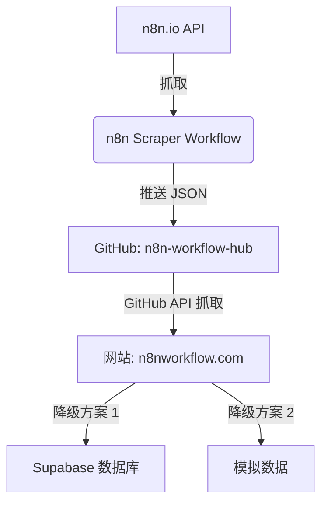

# GitHub Workflow Hub 集成指南

本文档详细说明了如何配置 n8n 与 GitHub 的集成，实现工作流数据的自动抓取、存储和展示。

## 1. 整体架构

整个自动化流程如下：

1.  **n8n 抓取**: n8n 定时触发工作流，从 n8n.io 抓取最新的工作流数据。
2.  **数据转换**: n8n 将抓取到的原始数据转换为本项目所需的 `metadata.json` 和 `workflow.json` 格式。
3.  **推送到 GitHub**: n8n 使用 GitHub 节点将数据推送到指定的 GitHub 仓库（例如 `n8n-workflow-hub`）。
4.  **网站展示**: `n8nworkflow.com` 网站通过 GitHub API 抓取该仓库中的数据并展示给用户。



## 2. n8n 端配置

### 2.1 创建 GitHub 凭据 (Credentials)

为了让 n8n 能够向 GitHub 仓库推送代码，你需要创建一个 GitHub 个人访问令牌 (Personal Access Token, PAT) 或使用 OAuth2。

**推荐使用 PAT (Classic):**

1.  登录 GitHub，进入 **Settings** -> **Developer settings** -> **Personal access tokens** -> **Tokens (classic)**。
2.  点击 **Generate new token (classic)**。
3.  设置 Note（如 `n8n-workflow-hub-sync`），勾选 `repo` 权限。
4.  生成并复制 Token。
5.  在 n8n 中，进入 **Credentials** -> **Add Credential**。
6.  搜索并选择 **GitHub API**。
7.  填入你的 GitHub 用户名和刚才生成的 Token。

### 2.2 导入工作流

1.  在 n8n 中创建一个新工作流。
2.  将 [`n8n-workflow-hub/n8n_scraper_workflow.json`](../n8n-workflow-hub/n8n_scraper_workflow.json) 的内容复制并粘贴到 n8n 编辑器中。
3.  配置 **GitHub 节点**:
    *   选择你刚才创建的凭据。
    *   设置 `Repository Owner` (你的用户名)。
    *   设置 `Repository Name` (例如 `n8n-workflow-hub`)。
4.  保存并激活工作流。

## 3. 网站端配置

### 3.1 配置环境变量

在网站根目录的 `.env.development` 或生产环境的环境变量中配置以下内容：

```env
# GitHub Workflow Hub 配置
GITHUB_TOKEN=your_github_personal_access_token
GITHUB_OWNER=your_github_username
GITHUB_REPO=n8n-workflow-hub
```

*   `GITHUB_TOKEN`: 具有读取该仓库权限的 Token（可以使用与 n8n 相同的 Token，或者创建一个只读 Token）。
*   `GITHUB_OWNER`: 仓库所有者的用户名。
*   `GITHUB_REPO`: 存储工作流数据的仓库名称。

### 3.2 验证集成

1.  启动开发服务器：`npm run dev`。
2.  访问首页或工作流列表页。
3.  检查控制台日志，确保没有 "GitHub 配置不完整" 的警告。
4.  如果配置正确，网站将优先展示来自 GitHub 仓库的工作流。

## 4. 健壮性说明

本项目实现了多级降级 (Fallback) 机制：

1.  **GitHub 优先**: 只要配置了 `GITHUB_TOKEN` 等变量，系统会尝试从 GitHub 获取最新数据。
2.  **Supabase 降级**: 如果 GitHub API 调用失败或未配置，系统会自动尝试从 Supabase 数据库获取数据。
3.  **Mock 数据兜底**: 如果以上两者都不可用，系统将展示内置的模拟数据，确保页面不会崩溃。

---

相关文件：
- [`src/lib/services/n8n.ts`](../n8nworkflow.com/src/lib/services/n8n.ts) - 包含 GitHub 抓取逻辑。
- [`src/lib/services/workflows.ts`](../n8nworkflow.com/src/lib/services/workflows.ts) - 包含 Fallback 调度逻辑。
