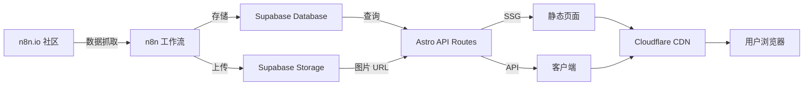

# N8N Workflows 项目整合文档

## 📋 项目总览

N8N Workflows 是一个现代化的 Web 应用程序，用于展示、浏览和搜索 N8N 自动化工作流。该项目采用 Astro 框架构建，提供快速、SEO 友好的静态站点生成能力，同时集成了 Supabase 作为后端数据库。

### 核心特性
- 🚀 **高性能**: 基于 Astro 的静态站点生成，首屏加载速度快
- 🔍 **强大搜索**: 全文搜索和多维度筛选功能
- 📱 **响应式设计**: 完美适配桌面、平板和移动设备
- ♿ **可访问性**: 遵循 WCAG 2.1 AA 标准
- 🎨 **现代 UI**: 使用 Tailwind CSS 构建的美观界面
- 🌙 **主题切换**: 支持亮色和暗色模式
- 📊 **SEO 优化**: 完整的 Meta 标签和结构化数据
- 🔄 **无限滚动**: 流畅的内容加载体验

---

## 🛠️ 技术栈

### 前端框架
- **Astro 4.0** - 现代静态站点生成器
- **TypeScript 5.0** - 类型安全的 JavaScript
- **Tailwind CSS 3.4** - 实用优先的 CSS 框架

### 后端服务
- **Supabase** - PostgreSQL 数据库和认证服务
- **Supabase Client** - JavaScript 客户端库

### 开发工具
- **Vite** - 快速的构建工具
- **ESLint** - 代码质量检查
- **Prettier** - 代码格式化

### 部署平台
- **Netlify** - 静态站点托管
- **GitHub Actions** - CI/CD 自动化

---

## 📁 项目结构

```
n8nworkflows.xyz/
├── public/                          # 静态资源目录
│   ├── fonts/                       # 字体文件
│   ├── images/                      # 图片资源
│   ├── favicon.ico                  # 网站图标
│   └── robots.txt                   # 搜索引擎爬虫配置
├── src/
│   ├── components/                  # 可复用组件
│   │   ├── common/                  # 通用组件
│   │   ├── workflow/                # 工作流相关组件
│   │   ├── ui/                      # UI 组件
│   │   └── seo/                     # SEO 相关组件
│   ├── layouts/                     # 页面布局
│   ├── pages/                       # 页面路由
│   ├── lib/                         # 工具库和服务
│   ├── scripts/                     # 客户端脚本
│   ├── styles/                      # 样式文件
│   └── data/                        # 静态数据
├── scripts/                         # 自动化脚本
├── plans/                           # 项目规划文档
├── exports/                         # 导出数据
└── astro.config.mjs                 # Astro 配置
```

---

## 🎯 已实现功能

### 核心功能
- ✅ Workflow 列表展示
- ✅ Workflow 详情页面
- ✅ Workflow 卡片组件
- ✅ 相关 Workflow 推荐
- ✅ 全文搜索功能
- ✅ 按分类筛选
- ✅ 按复杂度筛选
- ✅ 多维度排序
- ✅ 无限滚动加载
- ✅ 主题切换（亮色/暗色）
- ✅ 响应式设计

### SEO 和性能
- ✅ 动态 Meta 标签
- ✅ Open Graph 标签
- ✅ 结构化数据（Schema.org）
- ✅ Sitemap 生成
- ✅ 图片懒加载
- ✅ 代码分割
- ✅ CDN 配置

---

## 🔧 配置文件

### Astro 配置 (astro.config.mjs)
```javascript
import { defineConfig } from 'astro/config';
import tailwind from '@astrojs/tailwind';
import sitemap from '@astrojs/sitemap';

export default defineConfig({
  site: 'https://n8nworkflow.com',
  integrations: [
    tailwind(),
    sitemap(),
  ],
  output: 'static',
});
```

### Tailwind CSS 配置 (tailwind.config.js)
```javascript
export default {
  content: ['./src/**/*.{astro,html,js,jsx,md,mdx,svelte,ts,tsx,vue}'],
  darkMode: 'class',
  theme: {
    extend: {
      colors: {
        primary: { /* 自定义颜色 */ },
        secondary: { /* 自定义颜色 */ },
      },
      fontFamily: {
        sans: ['Inter', 'system-ui', 'sans-serif'],
        mono: ['JetBrains Mono', 'Consolas', 'monospace'],
      },
    },
  },
};
```

---

## 🚀 快速开始

### 环境要求
- Node.js >= 18.0.0
- npm >= 9.0.0

### 安装步骤
```bash
# 克隆项目
git clone <repository-url>
cd n8nworkflows.xyz

# 安装依赖
npm install

# 配置环境变量
cp .env.example .env

# 启动开发服务器
npm run dev
```

### 常用命令
```bash
npm run dev          # 启动开发服务器
npm run build        # 构建生产版本
npm run preview      # 预览生产构建
npm run format       # 格式化代码
```

---

## 📦 部署

### Netlify 部署（推荐）
1. 连接 GitHub 仓库到 Netlify
2. 配置构建设置：
   - Build command: `npm run build`
   - Publish directory: `dist`
3. 添加环境变量
4. 触发部署

### Docker 部署
```bash
# 构建镜像
docker build -t n8nworkflows:latest .

# 运行容器
docker run -p 4321:4321 --env-file .env n8nworkflows:latest
```

---

## 📚 文档索引

### 核心文档
- [`README.md`](README.md) - 项目介绍和快速开始
- [`ARCHITECTURE.md`](ARCHITECTURE.md) - 架构设计文档
- [`PROJECT_SUMMARY.md`](PROJECT_SUMMARY.md) - 完整的项目概览
- [`API.md`](API.md) - API 接口文档

### 开发文档
- [`SETUP.md`](SETUP.md) - 详细设置指南
- [`COMPONENTS.md`](COMPONENTS.md) - 组件文档
- [`OPTIMIZATION.md`](OPTIMIZATION.md) - 性能优化指南
- [`TESTING.md`](TESTING.md) - 测试指南
- [`TROUBLESHOOTING.md`](TROUBLESHOOTING.md) - 故障排除指南

### 部署文档
- [`DEPLOYMENT_CHECKLIST.md`](DEPLOYMENT_CHECKLIST.md) - 部署检查清单
- [`CLOUDFLARE_DEPLOYMENT.md`](CLOUDFLARE_DEPLOYMENT.md) - Cloudflare 部署指南

### 其他文档
- [`CHANGELOG.md`](CHANGELOG.md) - 更新日志
- [`CONTRIBUTING.md`](CONTRIBUTING.md) - 贡献指南
- [`LICENSE`](LICENSE) - MIT 许可证

---

## 📊 项目统计

### 代码统计
- **总文件数**: 100+
- **组件数量**: 25+
- **页面数量**: 15+
- **API 端点**: 3
- **代码行数**: 5000+

### 性能指标
- **Lighthouse 分数**: 90+
- **首次内容绘制 (FCP)**: < 1.8s
- **最大内容绘制 (LCP)**: < 2.5s
- **累积布局偏移 (CLS)**: < 0.1

---

## 🎓 学习资源

### 官方文档
- [Astro 文档](https://docs.astro.build/)
- [Tailwind CSS 文档](https://tailwindcss.com/docs)
- [Supabase 文档](https://supabase.com/docs)
- [TypeScript 文档](https://www.typescriptlang.org/docs/)

### 相关教程
- [Astro 快速入门](https://docs.astro.build/en/getting-started/)
- [Tailwind CSS 教程](https://tailwindcss.com/docs/utility-first)
- [Supabase 入门指南](https://supabase.com/docs/guides/getting-started)

---

## 🔮 未来计划

### v1.1.0（计划中）
- [ ] 用户认证系统
- [ ] Workflow 评论功能
- [ ] Workflow 评分系统
- [ ] 用户个人主页

### v1.2.0（计划中）
- [ ] Workflow 收藏功能
- [ ] Workflow 分享功能
- [ ] 社交媒体集成
- [ ] 邮件通知

### v2.0.0（远期计划）
- [ ] Workflow 编辑器
- [ ] 在线运行 Workflow
- [ ] API 密钥管理
- [ ] 团队协作功能

---

## 🤝 贡献

我们欢迎所有形式的贡献！请阅读 [`CONTRIBUTING.md`](CONTRIBUTING.md) 了解如何参与项目。

### 贡献方式
- 🐛 报告 Bug
- 💡 提出新功能建议
- 📝 改进文档
- 🎨 设计改进
- 💻 代码贡献

---

## 📄 许可证

本项目采用 MIT 许可证。详见 [`LICENSE`](LICENSE) 文件。

---

## 📞 联系方式

- **项目主页**: https://n8nworkflow.com
- **GitHub**: https://github.com/your-org/n8nworkflows.xyz
- **问题追踪**: https://github.com/your-org/n8nworkflows.xyz/issues
- **邮箱**: contact@n8nworkflow.com

---

## 🙏 致谢

感谢以下项目和社区：
- [Astro](https://astro.build/) - 优秀的静态站点生成器
- [Supabase](https://supabase.com/) - 强大的后端服务
- [Tailwind CSS](https://tailwindcss.com/) - 灵活的 CSS 框架
- [N8N](https://n8n.io/) - 自动化工作流平台
- 所有贡献者和支持者

---

## 📋 任务历史总结

### 近期任务概览

基于 `exports/kilo_tasks/` 目录中的历史记录，以下是项目中完成的主要任务：

#### 架构质量评估 (8ac2da59-692f-45fb-8e30-e4f328cdf2ca)
- **任务目标**: 评估技术架构质量（Maintainability, Scalability, Reusability, Configurability, Customizability, Portability）
- **关键发现**:
  - 可维护性: 良（目录结构清晰，类型安全，但存在部分 TODO 和硬编码）
  - 可扩展性: 优（服务层抽象良好，组件设计独立）
  - 可重用性: 极优（工具函数抽象程度高，可独立使用）
  - 可配置性: 良（环境变量管理良好，但存在硬编码阈值）
  - 可移植性: 极优（框架中立，可轻松迁移到其他平台）
- **改进建议**:
  - 消除硬编码参数
  - 统一数据流逻辑
  - 抽象 API 验证工具
  - 清理代码中的 TODO

#### 其他历史任务
- 内容抓取策略优化
- 动态内容策略设计
- 代码结构重构
- GitHub 项目设置
- 实施检查清单
- 启动清单制定
- 监控仪表板设计
- 项目里程碑规划
- 重新设计规范
- 利益相关者协调
- 技术架构设计
- 用户测试计划
- 网站对比分析
- 周报模板设计

---

## 🔄 数据流架构



---

## 📈 性能优化策略

### 图片优化
- 使用 WebP 格式
- 实现懒加载（loading="lazy"）
- 响应式图片（srcset）
- CDN 加速

### 代码优化
- 按路由分割代码
- 动态导入非关键组件
- Tree-shaking 移除未使用代码
- 压缩和混淆

### 缓存策略
- 静态资源缓存（max-age=31536000）
- API 响应缓存（max-age=300）
- CDN 配置

---

## 🔒 安全考虑

### 环境变量管理
- 使用 `.env` 文件存储敏感信息
- 不提交 `.env` 到版本控制
- 使用 `PUBLIC_` 前缀区分公开和私密变量

### API 安全
- 使用 Supabase Row Level Security (RLS)
- 限制 API 请求频率
- 验证和清理用户输入
- CORS 配置

### 内容安全策略 (CSP)
```html
<meta http-equiv="Content-Security-Policy"
      content="default-src 'self';
               script-src 'self' 'unsafe-inline' https://www.googletagmanager.com;
               style-src 'self' 'unsafe-inline';
               img-src 'self' data: https://supabase.amastuces.com;">
```

---

## 🎯 开发工作流

### 本地开发
```bash
# 安装依赖
npm install

# 启动开发服务器
npm run dev

# 构建生产版本
npm run build

# 预览生产构建
npm run preview
```

### 代码规范
- **代码风格**: Prettier
- **提交规范**: Conventional Commits
- **分支策略**: Git Flow

---

## 📊 监控和分析

### 性能监控
- Cloudflare Analytics
- Google Analytics 4
- Lighthouse CI
- Web Vitals

### 关键指标
- LCP (Largest Contentful Paint) < 2.5s
- FID (First Input Delay) < 100ms
- CLS (Cumulative Layout Shift) < 0.1
- TTFB (Time to First Byte) < 600ms

---

**最后更新**: 2026-01-14  
**版本**: 1.0.0  
**状态**: ✅ 生产就绪