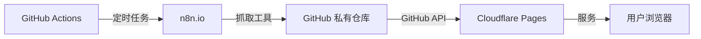
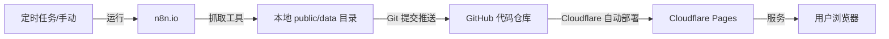
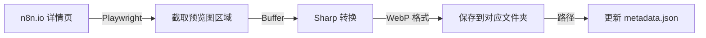
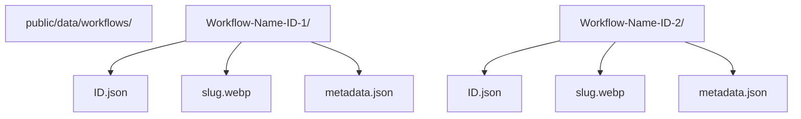
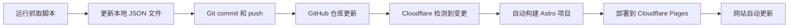

# N8N 工作流内容抓取方案

> **创建时间**: 2026-01-12  
> **目标**: 为 n8nworkflows.xyz 网站填充真实的 n8n 工作流内容  
> **当前状态**: 设计阶段

---

## 执行摘要

本方案提供了一套完整的内容抓取和管理策略，用于从 n8n.io 官方网站获取工作流数据并部署到我们的 Cloudflare Pages 网站。经过详细分析，**我们推荐采用本地 JSON 存储方案（方案 B）**，因其维护简单、部署高效、适合非技术用户。

---

## 1. 竞争网站分析

### 1.1 n8nworkflows.xyz 竞争对手分析

**网站概况**
- **URL**: https://n8nworkflows.xyz/
- **GitHub**: https://github.com/nusquama/n8nworkflows.xyz
- **工作流数量**: 7,995+ 个工作流（截至 2026-01-12）
- **技术栈**: Astro（与我们相同）

**关键发现**

1. **数据来源**: 
   - 从 n8n.io 官方工作流库抓取
   - 数据存储在 GitHub 仓库的 `/workflows` 目录

2. **数据组织结构**:
   ```
   public/data/workflows/
   └── [Workflow-Name]-[ID]/
       ├── [ID].json (工作流定义)
       ├── [slug].webp (特色图片/预览图)
       └── metadata.json (元数据)
   ```

3. **每个工作流包含**:
   - **JSON 工作流文件**: 完整的 n8n 工作流配置
   - **特色图片 (WebP)**: 优化后的工作流预览图
   - **metadata.json**: 包含用户信息、标签、复杂度等元数据

4. **展示特点**:
   - 工作流卡片展示（缩略图、标题、描述、复杂度标签）
   - 分类筛选（AI、Sales、IT Ops、Marketing 等）
   - 搜索功能
   - 复杂度级别标签（Free、intermediate、advanced）

### 1.2 n8n.io 官方网站分析

**工作流库信息**
- **URL**: https://n8n.io/workflows
- **总数**: 7,806 个工作流模板
- **分类**: AI、Sales、IT Ops、Marketing、Document Ops、Other、Support

**数据特征**
- 每个工作流都有唯一的 ID
- 包含作者信息、使用节点、复杂度等元数据
- 提供 JSON 导出功能
- 展示工作流缩略图和详细说明

**数据获取方式分析**
- ❌ **未发现公开 API 文档**
- ✅ **可能的方法**: 网页抓取或逆向工程前端 API 调用
- ⚠️ **法律考虑**: 需遵守 n8n.io 的服务条款和 robots.txt

---

## 2. 方案对比分析

### 方案 A: GitHub 作为数据源

**架构流程图**


**优势**
1. ✅ 版本控制和历史记录
2. ✅ 方便回滚和审计
3. ✅ 可以使用 GitHub Actions 自动化
4. ✅ 数据和代码分离管理
5. ✅ 支持多人协作

**劣势**
1. ❌ 依赖 GitHub API（有速率限制）
2. ❌ 部署时需要额外的 API 调用
3. ❌ 对非技术用户较复杂
4. ❌ 增加网站加载时间
5. ❌ GitHub 私有仓库可能产生费用

**技术实现要点**
- 抓取脚本将数据推送到 GitHub
- Astro 在构建时通过 GitHub API 获取数据
- 需要配置 GitHub token
- API 速率限制: 5000 请求/小时（认证用户）

### 方案 B: 本地 JSON 存储（⭐ 推荐）

**架构流程图**


**优势**
1. ✅ **极简维护**: 对非技术用户友好
2. ✅ **快速部署**: 数据随代码一起构建
3. ✅ **无 API 依赖**: 无速率限制担忧
4. ✅ **零额外成本**: 完全基于 Cloudflare 免费套餐
5. ✅ **高性能**: 静态数据，无运行时查询
6. ✅ **简单自动化**: 一个命令完成更新

**劣势**
1. ⚠️ 大文件可能影响 Git 仓库大小
2. ⚠️ 构建时间随数据量增加
3. ⚠️ 每次更新需要重新部署

**缓解措施**
- 使用 JSON 压缩存储
- 只保留必要字段
- 定期清理 Git 历史（如需要）
- 考虑使用 Cloudflare R2 存储图片

**技术实现要点**
- 数据存储在 `/public/data/workflows/` 目录
- Astro 在构建时直接引用静态资源路径
- 使用 `git add` 提交数据
- Cloudflare 自动检测并部署

### 方案对比表

| 特性 | 方案 A（GitHub 数据源） | 方案 B（本地存储）⭐ |
|------|----------------------|---------------------|
| **维护复杂度** | 高（需要理解 API） | 低（只需文件操作） |
| **部署速度** | 慢（运行时 API 调用） | 快（构建时处理） |
| **用户友好度** | 低 | 高 |
| **API 依赖** | 依赖 GitHub API | 无依赖 |
| **成本** | 可能需要付费 | 完全免费 |
| **性能** | 一般（运行时查询） | 优秀（静态资源） |
| **增量更新** | 复杂 | 简单 |
| **版本控制** | 两个仓库 | 一个仓库 |
| **Cloudflare 兼容性** | 需要环境变量 | 完美兼容 |
| **适合场景** | 大团队协作 | 个人/小团队维护 |

---

## 3. 推荐方案：本地 JSON 存储（方案 B）

### 3.1 为什么选择方案 B？

基于以下关键因素，我们强烈推荐方案 B：

1. **用户技能匹配**: 你提到"不懂代码"，方案 B 只需运行一个命令，无需理解复杂的 API 调用
2. **Cloudflare 特性**: Pages 对静态构建优化，方案 B 完全发挥其优势
3. **维护成本**: 方案 B 几乎零维护成本，适合个人项目
4. **性能最优**: 静态数据加载速度最快，无运行时开销
5. **成本效益**: 完全免费，无隐藏费用

---

## 4. 详细技术方案

### 4.1 数据抓取策略

#### 4.1.1 抓取源

**n8n.io 官方工作流库**
- **主 URL**: https://n8n.io/workflows
- **数据格式**: 通过网页或前端 API 抓取
- **内容**: 工作流元数据、JSON 文件、作者信息、预览图

**抓取工具技术栈建议**

考虑到需要抓取动态生成的预览图，我们推荐以下方案：

**选项 1: Playwright/Puppeteer 脚本 (⭐ 推荐)**
- 使用 headless 浏览器访问工作流详情页
- 等待预览图组件加载完成
- 对预览图区域进行截图并保存
- 优势：能够获取最真实的预览效果，不受动态生成限制

**选项 2: n8n 工作流**
- 使用 n8n 本身抓取 n8n.io 数据
- 优势：无需写代码，可视化配置
- 局限：抓取动态图片可能较复杂

#### 4.1.2 抓取字段映射

从 n8n.io 抓取的字段 → 我们的的数据结构：

```typescript
{
  // n8n.io 字段 → 我们的字段
  "id": "工作流唯一ID",
  "name": "title",
  "description": "description",
  "workflow_id": "slug", // 需要转换为 URL 友好格式
  "featuredImage": "/data/workflows/[slug]-[id]/[slug].webp", // 新增字段
  "user": {
    "username": "author.slug",
    "full_name": "author.name",
    "image": "author.avatar",
    "bio": "author.bio"
  },
  "tags": "categories", // 需要映射分类
  "views": "visitors",
  "downloads": "downloads",
  "created_at": "createdAt",
  "updated_at": "updatedAt",
  "workflow": "JSON 工作流文件"
}
```

**必需字段**（满足 Workflow 接口）：
- ✅ id, slug, title, description
- ✅ author (name, slug, avatar)
- ✅ categories, complexityLevel
- ✅ price, visitors, downloads
- ✅ createdAt, updatedAt, publishedAt
- ✅ nodes, version
- ✅ featuredImage (WebP 格式)

#### 4.1.3 图片处理策略

**图片处理流程图**：


**WebP 转换流程**：
1. **抓取**: 使用 Playwright 截取工作流预览图（PNG 格式）。
2. **转换**: 使用 `sharp` 库将 PNG 转换为 WebP。
   ```javascript
   const sharp = require('sharp');
   await sharp(inputBuffer)
     .webp({ quality: 80 })
     .toFile(outputPath);
   ```
3. **优化**: 调整尺寸（如 1200x630）以适应社交媒体分享和卡片展示。

### 4.2 数据存储方案

#### 4.2.1 文件组织结构

**推荐的目录结构（文件夹式）**：



**推荐的目录结构（文件夹式）**：

```
public/data/workflows/
├── [Workflow-Name]-[ID]/
│   ├── [ID].json          # 完整的工作流定义
│   ├── [slug].webp        # 优化后的特色图片
│   └── metadata.json      # 元数据（包含 featuredImage 路径）
├── authors/
│   └── authors.json       # 所有作者信息
├── categories/
│   └── categories.json    # 所有分类信息
└── metadata.json          # 全局元数据
```

**命名规范**：
- 文件夹名: `[slug]-[id]` (例如: `email-reports-12399`)
- 图片名: `[slug].webp`
- 确保 URL 友好且包含 ID 以防冲突。

#### 4.2.2 数据格式示例

**metadata.json** (工作流文件夹内):
```json
{
  "id": 12399,
  "slug": "email-reports-on-expiring-microsoft-entra-id-12399",
  "title": "Email reports on expiring Microsoft Entra ID",
  "description": "Automate Entra ID secret/cert expiry monitoring",
  "featuredImage": "/data/workflows/email-reports-12399/email-reports.webp",
  "author": {
    "slug": "yaron-nofluff",
    "name": "Yaron Been",
    "avatar": "/images/authors/yaron.jpg"
  },
  "categories": ["DevOps", "Security"],
  "complexityLevel": "advanced",
  "createdAt": "2026-01-02T00:00:00Z",
  "updatedAt": "2026-01-02T00:00:00Z",
  "nodes": 12,
  "version": "1.0.0"
}
```

---

可能會有些時期無法直接轉換篤對的圖案格式，這時可以考慮首饰建立一個特定的 Convert PNG to WebP 的簡單腳本，近些年iful JS 等輕量建置應用也很適合滿足需求。

#### 4.2.3 与现有项目集成

**替换 mock-workflows.ts**：

1. **创建数据加载模块** `src/lib/services/workflows.ts`:
   ```typescript
   import workflowsData from '@/data/workflows.json';
   
   export function getAllWorkflows() {
     return workflowsData;
   }
   
   export function getWorkflowBySlug(slug: string) {
     return workflowsData.find(w => w.slug === slug);
   }
   ```

2. **更新使用位置**:
   - `src/pages/index.astro`: 导入真实数据
   - `src/pages/workflows/[slug].astro`: 导入详细数据
   - 删除或重命名 `mock-workflows.ts`

### 4.3 URL 路由设计

#### 4.3.1 使用 n8n.io 工作流 ID

**路由映射**：
- n8n.io: `https://n8n.io/workflows/{id}`
- 我们的网站: `https://n8nworkflows.xyz/workflows/{slug}`

**slug 生成规则**：
```typescript
// 从标题生成 slug
function generateSlug(title: string, id: number): string {
  const slug = title
    .toLowerCase()
    .replace(/[^a-z0-9]+/g, '-')  // 替换特殊字符
    .replace(/(^-|-$)/g, '');     // 去除首尾连字符
  return `${slug}-${id}`;  // 添加 ID 避免冲突
}

// 示例
generateSlug("Email Reports on Expiring Microsoft Entra ID", 12399)
// → "email-reports-on-expiring-microsoft-entra-id-12399"
```

**反向解析**：
```typescript
function getIdFromSlug(slug: string): number {
  const parts = slug.split('-');
  return parseInt(parts[parts.length - 1]);
}
```

#### 4.3.2 与现有 [slug].astro 集成

**无需修改路由文件**，当前的 `src/pages/workflows/[slug].astro` 已经支持：

```typescript
// src/pages/workflows/[slug].astro
export async function getStaticPaths() {
  const workflows = getAllWorkflows(); // 使用真实数据
  
  return workflows.map(workflow => ({
    params: { slug: workflow.slug },
    props: { workflow }
  }));
}
```

### 4.4 自动化更新机制

#### 4.4.1 GitHub Actions 自动化（推荐）

**工作流文件** `.github/workflows/crawl-workflows.yml`:

```yaml
name: Crawl N8N Workflows

on:
  schedule:
    # 每周更新一次（周一早上 2 点）
    - cron: '0 2 * * 1'
  workflow_dispatch: # 允许手动触发

jobs:
  crawl:
    runs-on: ubuntu-latest
    
    steps:
      - name: Checkout code
        uses: actions/checkout@v4
      
      - name: Setup Node.js
        uses: actions/setup-node@v4
        with:
          node-version: '20'
      
      - name: Install dependencies
        run: npm ci
      
      - name: Run crawler
        run: npm run crawl
        env:
          N8N_API_KEY: ${{ secrets.N8N_API_KEY }}
      
      - name: Commit and push if changed
        run: |
          git config user.name "GitHub Actions Bot"
          git config user.email "bot@github.com"
          git add src/data/
          git diff --quiet && git diff --staged --quiet || (
            git commit -m "chore: update workflows data [skip ci]"
            git push
          )
```

**优势**：
- ✅ 完全自动化，无需手动干预
- ✅ 定时更新（每周、每天、每月可配置）
- ✅ 变更自动触发部署
- ✅ 可手动触发更新

#### 4.4.2 本地脚本更新（简单方案）

**创建更新脚本** `scripts/update-workflows.sh`:

```bash
#!/bin/bash

# 运行抓取工具
npm run crawl

# 提交到 Git
git add src/data/
git commit -m "chore: update workflows data $(date +%Y-%m-%d)"
git push

echo "✅ Workflows data updated and pushed!"
```

**使用方法**（你只需运行）：
```bash
chmod +x scripts/update-workflows.sh
./scripts/update-workflows.sh
```

或在 `package.json` 添加快捷命令：
```json
{
  "scripts": {
    "update": "node scripts/crawl.js && git add src/data/ && git commit -m 'chore: update workflows' && git push"
  }
}
```

然后运行：
```bash
npm run update
```

#### 4.4.3 部署流程

Cloudflare Pages 自动部署流程：



**无需额外配置**，Cloudflare Pages 已经监控你的 GitHub 仓库。

### 4.5 维护和监控

#### 4.5.1 错误处理

**抓取脚本错误处理**：
```typescript
// 伪代码
try {
  const workflows = await fetchWorkflows();
  saveWorkflows(workflows);
  console.log(`✅ 成功抓取 ${workflows.length} 个工作流`);
} catch (error) {
  console.error('❌ 抓取失败:', error.message);
  // 发送通知邮件或 Slack 消息
  notifyError(error);
  process.exit(1);
}
```

**数据验证**：
```typescript
function validateWorkflow(workflow: any): boolean {
  const required = ['id', 'slug', 'title', 'description'];
  return required.every(field => workflow[field]);
}
```

#### 4.5.2 日志记录

**抓取日志文件** `logs/crawl-YYYY-MM-DD.log`:
```
[2026-01-12 10:00:00] 开始抓取...
[2026-01-12 10:00:05] 发现 50 个新工作流
[2026-01-12 10:00:10] 已抓取: 12399 - Email reports on expiring Microsoft Entra ID
[2026-01-12 10:05:00] 抓取完成: 50/50 成功, 0 失败
[2026-01-12 10:05:05] 数据保存到 src/data/workflows.json
```

#### 4.5.3 数据质量检查

**检查清单**：
- [ ] 所有工作流都有唯一 ID
- [ ] 没有重复的 slug
- [ ] 所有必需字段都存在
- [ ] 日期格式正确（ISO 8601）
- [ ] 分类和作者引用有效
- [ ] 图片链接可访问

**自动化检查脚本** `scripts/validate-data.js`:
```javascript
const workflows = require('../src/data/workflows.json');

let errors = 0;

workflows.forEach(workflow => {
  if (!workflow.id) {
    console.error(`❌ 工作流缺少 ID: ${workflow.slug}`);
    errors++;
  }
  // 更多检查...
});

if (errors === 0) {
  console.log('✅ 数据验证通过');
} else {
  console.error(`❌ 发现 ${errors} 个错误`);
  process.exit(1);
}
```

---

## 5. 实施步骤清单

### 阶段 1: 准备工作

- [ ] **1.1** 研究 n8n.io 的 robots.txt 和服务条款
- [ ] **1.2** 确认数据使用的合法性
- [ ] **1.3** 决定抓取工具方案（n8n 工作流 vs 脚本）
- [ ] **1.4** 准备开发环境

### 阶段 2: 数据抓取工具开发

- [ ] **2.1** 创建抓取脚本或 n8n 工作流
- [ ] **2.2** 实现字段映射逻辑
- [ ] **2.3** 添加增量抓取功能
- [ ] **2.4** 实现错误处理和重试机制
- [ ] **2.5** 测试抓取少量数据（10-20 个工作流）

### 阶段 3: 数据存储实施

- [ ] **3.1** 创建 `src/data/workflows/` 目录结构
- [ ] **3.2** 定义 JSON 数据格式
- [ ] **3.3** 实现数据保存逻辑
- [ ] **3.4** 添加数据压缩（如需要）
- [ ] **3.5** 创建 metadata.json

### 阶段 4: 项目集成

- [ ] **4.1** 更新 `src/lib/services/workflows.ts` 加载真实数据
- [ ] **4.2** 修改 `src/pages/index.astro` 使用真实数据
- [ ] **4.3** 修改 `src/pages/workflows/[slug].astro` 使用真实数据
- [ ] **4.4** 更新所有 API 端点（如有）
- [ ] **4.5** 本地测试所有页面正常显示

### 阶段 5: 图片和媒体处理

- [ ] **5.1** 决定图片存储方案（Cloudflare R2 vs 本地 vs CDN）
- [ ] **5.2** 抓取或生成工作流缩略图
- [ ] **5.3** 优化图片大小和格式
- [ ] **5.4** 更新图片路径引用

### 阶段 6: 自动化配置

- [ ] **6.1** 创建 GitHub Actions 工作流文件
- [ ] **6.2** 配置环境变量和密钥（如需要）
- [ ] **6.3** 测试自动化流程
- [ ] **6.4** 设置定时更新（每周/每月）
- [ ] **6.5** 配置错误通知

### 阶段 7: 测试和优化

- [ ] **7.1** 完整抓取所有数据（7000+ 工作流）
- [ ] **7.2** 测试网站构建时间
- [ ] **7.3** 测试搜索和筛选功能
- [ ] **7.4** 性能优化（如需要）
- [ ] **7.5** 验证 SEO 元数据

### 阶段 8: 部署上线

- [ ] **8.1** 提交代码到 GitHub
- [ ] **8.2** 等待 Cloudflare Pages 自动部署
- [ ] **8.3** 验证生产环境
- [ ] **8.4** 测试所有功能
- [ ] **8.5** 监控错误日志

### 阶段 9: 维护计划

- [ ] **9.1** 设置定期更新提醒
- [ ] **9.2** 监控数据质量
- [ ] **9.3** 处理用户反馈
- [ ] **9.4** 定期检查 n8n.io 变化

---

## 6. 风险评估和注意事项

### 6.1 法律和版权风险

#### ⚠️ 重要法律考虑

**版权问题**：
- n8n.io 上的工作流可能受版权保护
- 元数据（标题、描述）可能属于 n8n 或工作流作者
- 工作流 JSON 文件属于作者知识产权

**建议行动**：
1. 📋 **审查 n8n.io 服务条款**: 查找关于数据使用的条款
2. 📋 **检查 robots.txt**: `https://n8n.io/robots.txt` 确认是否允许抓取
3. 📋 **考虑联系 n8n 团队**: 申请官方数据使用许可
4. 📋 **标注数据来源**: 明确标注"数据来源于 n8n.io"
5. 📋 **保留原始链接**: 每个工作流提供回链到 n8n.io

**免责声明建议**：
```
本网站展示的工作流数据来源于 n8n.io 公开工作流库。
所有工作流的版权归原作者所有。
如有版权问题，请联系我们删除。
```

### 6.2 技术风险

#### 风险 1: n8n.io 网站结构变化
- **影响**: 抓取脚本失效
- **缓解**: 定期测试抓取功能，保留旧数据作为备份

#### 风险 2: 数据量过大
- **影响**: Git 仓库膨胀，构建时间过长
- **缓解**: 
  - 分批存储 JSON 文件
  - 使用 Cloudflare R2 存储大文件
  - 定期清理 Git 历史

#### 风险 3: Cloudflare Pages 构建限制
- **限制**: 免费套餐有构建时间限制（通常 20 分钟）
- **缓解**: 优化构建流程，必要时升级套餐

#### 风险 4: 抓取被封禁
- **影响**: IP 被 n8n.io 封禁
- **缓解**: 
  - 添加延迟（每个请求间隔 1-2 秒）
  - 使用合理的 User-Agent
  - 避免短时间大量请求

### 6.3 运营风险

#### 风险 1: 数据过期
- **影响**: 显示过时的工作流信息
- **缓解**: 设置自动更新提醒，每周/每月更新

#### 风险 2: 维护负担
- **影响**: 需要持续维护抓取脚本
- **缓解**: 详细文档，简化更新流程

---

## 7. 成本分析

### 7.1 开发成本

| 项目 | 方案 A（GitHub）| 方案 B（本地）⭐ |
|------|----------------|-----------------|
| 抓取工具开发 | 中等 | 中等 |
| 数据存储配置 | 复杂 | 简单 |
| 项目集成 | 复杂 | 简单 |
| 总开发难度 | 高 | 低 |

### 7.2 运营成本

| 项目 | 方案 A | 方案 B ⭐ |
|------|--------|----------|
| Cloudflare Pages | 免费 | 免费 |
| GitHub 私有仓库 | $4-7/月 | 免费（公开仓库） |
| GitHub API | 免费 | 不需要 |
| 维护工作量 | 中等 | 低 |
| **月度总成本** | **$4-7** | **$0** |

---

## 8. 后续维护计划

### 8.1 日常维护（每周）

- [ ] 检查 GitHub Actions 是否正常运行
- [ ] 查看错误日志
- [ ] 验证网站功能正常

### 8.2 内容更新（每周/每月）

- [ ] 运行抓取脚本获取新工作流
- [ ] 检查数据质量
- [ ] 提交和部署更新

### 8.3 定期审查（每季度）

- [ ] 审查 n8n.io 服务条款变化
- [ ] 评估数据存储方案是否需要优化
- [ ] 分析用户反馈
- [ ] 更新抓取脚本以适应 n8n.io 变化

### 8.4 应急响应计划

**如果抓取失败**：
1. 检查 n8n.io 网站是否可访问
2. 检查网站结构是否变化
3. 使用备份数据
4. 联系技术支持（如有）

**如果部署失败**：
1. 检查 Cloudflare Pages 构建日志
2. 检查数据文件格式是否正确
3. 回滚到上一个稳定版本
4. 修复问题后重新部署

---

## 9. 参考资源

### 9.1 官方文档

- n8n 官方文档: https://docs.n8n.io/
- n8n GitHub: https://github.com/n8n-io/n8n
- Cloudflare Pages 文档: https://developers.cloudflare.com/pages/
- Astro 文档: https://docs.astro.build/

### 9.2 相关项目

- nusquama/n8nworkflows.xyz: https://github.com/nusquama/n8nworkflows.xyz
- n8n Community: https://community.n8n.io/

### 9.3 工具推荐

- **抓取工具**: n8n、Puppeteer、Playwright
- **数据处理**: jq、csvkit
- **Git 管理**: GitHub Desktop、Sourcetree
- **监控**: UptimeRobot、Checkly

---

## 10. 快速开始指南

如果你想立即开始实施，按以下步骤进行：

### 第一步：选择抓取工具
- ✅ **推荐**: 使用 n8n 本身创建抓取工作流
- 📝 备选: 请技术人员开发简单脚本

### 第二步：小规模测试
- 抓取 10-20 个工作流
- 保存到 `src/data/test-workflows.json`
- 本地测试网站显示

### 第三步：完整抓取
- 抓取所有 7000+ 工作流
- 保存到 `src/data/workflows.json`
- 部署到 Cloudflare

### 第四步：配置自动更新
- 设置 GitHub Actions
- 测试自动化流程

---

## 附录 A: 抓取脚本示例

### 示例 1: 基础 Node.js 抓取脚本

```javascript
// scripts/crawl.js
const fs = require('fs');
const axios = require('axios');

async function crawlWorkflows() {
  const workflows = [];
  
  try {
    // 假设 n8n.io 有这样的 API（需要实际研究）
    const response = await axios.get('https://n8n.io/api/workflows');
    const data = response.data;
    
    for (const item of data) {
      workflows.push({
        id: item.id,
        slug: generateSlug(item.name, item.id),
        title: item.name,
        description: item.description || '',
        author: {
          slug: item.user.username,
          name: item.user.full_name,
          avatar: item.user.image
        },
        categories: item.tags || [],
        complexityLevel: determineComplexity(item),
        price: 0,
        visitors: item.views || 0,
        downloads: item.downloads || 0,
        createdAt: item.created_at,
        updatedAt: item.updated_at,
        publishedAt: item.created_at,
        nodes: item.node_count || 0,
        version: '1.0.0'
      });
    }
    
    // 保存数据
    fs.writeFileSync(
      'src/data/workflows.json',
      JSON.stringify(workflows, null, 2)
    );
    
    console.log(`✅ 成功抓取 ${workflows.length} 个工作流`);
  } catch (error) {
    console.error('❌ 抓取失败:', error.message);
    process.exit(1);
  }
}

function generateSlug(title, id) {
  return title.toLowerCase()
    .replace(/[^a-z0-9]+/g, '-')
    .replace(/(^-|-$)/g, '') + '-' + id;
}

function determineComplexity(workflow) {
  const nodeCount = workflow.node_count || 0;
  if (nodeCount < 5) return 'beginner';
  if (nodeCount < 15) return 'intermediate';
  return 'advanced';
}

crawlWorkflows();
```

### 示例 2: n8n 工作流配置

```json
{
  "name": "CrawlN8NWorkflows",
  "nodes": [
    {
      "parameters": {
        "rule": {
          "interval": [{ "field": "weeks", "value": 1 }]
        }
      },
      "name": "Schedule",
      "type": "n8n-nodes-base.scheduleTrigger"
    },
    {
      "parameters": {
        "url": "https://n8n.io/workflows",
        "options": {}
      },
      "name": "HTTPRequest",
      "type": "n8n-nodes-base.httpRequest"
    },
    {
      "parameters": {
        "jsCode": "// 数据转换逻辑"
      },
      "name": "TransformData",
      "type": "n8n-nodes-base.code"
    },
    {
      "parameters": {
        "filePath": "=/data/workflows.json",
        "options": {}
      },
      "name": "WriteFile",
      "type": "n8n-nodes-base.writeFile"
    }
  ]
}
```

---

## 附录 B: 常见问题解答

### Q1: 抓取 n8n.io 数据合法吗？
**A**: 需要仔细审查 n8n.io 的服务条款。建议：
1. 查看 robots.txt
2. 联系 n8n 团队申请许可
3. 标注数据来源和版权

### Q2: 需要多长时间实施？
**A**: 
- 抓取工具开发: 1-3 天
- 项目集成: 1-2 天
- 测试和优化: 1-2 天
- **总计**: 约 3-7 天

### Q3: 如果 n8n.io 的 API 变化怎么办？
**A**: 
- 保留旧数据作为备份
- 定期（每季度）审查抓取脚本
- 加入 n8n 社区获取变更通知

### Q4: 数据更新频率应该多高？
**A**: 
- **推荐**: 每周一次
- **最低**: 每月一次
- **根据**: n8n.io 新工作流发布频率

### Q5: Cloudflare Pages 免费套餐够用吗？
**A**: 
- **通常足够**: 支持无限请求
- **注意**: 构建时间有限制（20 分钟）
- **建议**: 优化构建流程

---

## 结论

本方案为 n8nworkflows.xyz 网站提供了一套完整、可行的内容抓取和管理策略。**我们强烈推荐采用方案 B（本地 JSON 存储）**，因为它：

1. ✅ **最适合非技术用户**: 维护简单，只需运行命令
2. ✅ **完全免费**: 无任何隐藏成本
3. ✅ **性能最优**: 静态数据，加载速度快
4. ✅ **完美匹配 Cloudflare**: 充分发挥 Pages 优势

**下一步行动**：
1. 审查 n8n.io 法律条款
2. 开发或配置抓取工具
3. 小规模测试（10-20 个工作流）
4. 完整部署

**需要帮助？**
- 查看实施步骤清单
- 参考抓取脚本示例
- 查阅常见问题解答

---

**文档版本**: 1.0.0  
**最后更新**: 2026-01-12  
**作者**: AI Architect  
**审核状态**: 待用户审核
