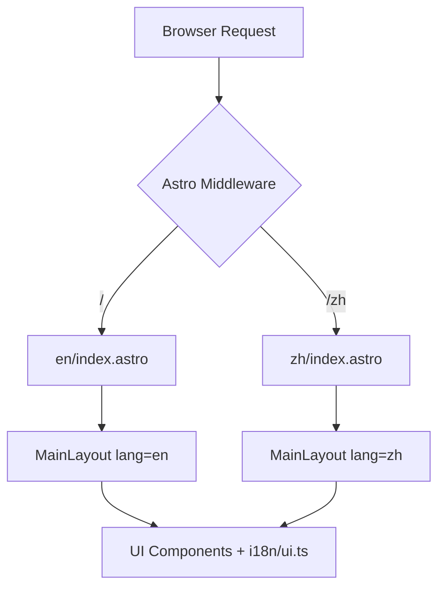

# Astro i18n 设计方案 - n8nworkflows.xyz

本方案旨在为项目添加多语言支持（中文 `zh` 和英文 `en`），基于 Astro 原生 i18n 路由功能。

## 1. 路由策略

我们将使用 Astro 的内置 i18n 路由。

- **默认语言**: 英文 (`en`)
- **支持语言**: 英文 (`en`), 中文 (`zh`)
- **URL 结构**:
  - 英文 (默认): `n8nworkflow.com/` (不带前缀)
  - 中文: `n8nworkflow.com/zh/`
- **回退策略**: 如果中文页面不存在，回退到英文页面。

### 配置文件修改 (`astro.config.mjs`)

```javascript
export default defineConfig({
  // ... existing config
  i18n: {
    defaultLocale: 'en',
    locales: ['en', 'zh'],
    routing: {
      prefixDefaultLocale: false,
      fallbackType: 'redirect'
    },
    fallback: {
      zh: 'en'
    }
  }
});
```

## 2. 翻译文件结构

我们将创建一个简单的翻译系统来处理 UI 文本。

### 目录结构
```text
src/
  i18n/
    ui.ts       # 定义 UI 文本翻译
    utils.ts    # 翻译辅助函数 (getLangFromUrl, useTranslations)
```

### `src/i18n/ui.ts` 示例
```typescript
export const languages = {
  en: 'English',
  zh: '简体中文',
};

export const defaultLang = 'en';

export const ui = {
  en: {
    'nav.popular': 'Popular',
    'nav.recent': 'Recent',
    'hero.title': 'Discover Powerful N8N Workflows',
    // ...
  },
  zh: {
    'nav.popular': '热门',
    'nav.recent': '最新',
    'hero.title': '探索强大的 N8N 工作流',
    // ...
  },
} as const;
```

## 3. 页面结构调整

为了支持多语言，我们需要调整 `src/pages` 的结构。

### 调整前
```text
src/pages/
  index.astro
  about.astro
  workflows/
    [slug].astro
```

### 调整后
```text
src/pages/
  index.astro          # 默认语言 (en)
  about.astro          # 默认语言 (en)
  zh/
    index.astro        # 中文首页
    about.astro        # 中文关于页
    workflows/
      [slug].astro     # 中文工作流详情
  workflows/
    [slug].astro       # 默认语言工作流详情
```

*注：对于动态路由（如 `[slug].astro`），我们需要在 `getStaticPaths` 中处理语言逻辑，或者使用 SSR 模式下的语言检测。*

## 4. UI 组件适配

### 语言切换器 (`LanguagePicker.astro`)
创建一个新组件允许用户切换语言。

### Header 适配
修改 `Header.astro` 以使用翻译后的导航项，并集成 `LanguagePicker`。

```astro
---
import { getLangFromUrl, useTranslations } from '../i18n/utils';
const lang = getLangFromUrl(Astro.url);
const t = useTranslations(lang);
---
<a href={getRelativeLocaleUrl(lang, '/popular')}>{t('nav.popular')}</a>
```

## 5. 实施步骤

1. **初始化**: 创建 `src/i18n` 目录及相关文件。
2. **配置**: 更新 `astro.config.mjs`。
3. **重构 Layout**: 修改 `MainLayout.astro` 以接受 `lang` 参数并设置 `<html>` 的 `lang` 属性。
4. **迁移页面**:
   - 创建 `src/pages/zh` 目录。
   - 复制并翻译主要页面（index, about, search 等）。
5. **适配组件**: 更新 Header, Footer, Hero 等组件使用 `useTranslations`。
6. **SEO 优化**: 更新 `SEOHead.astro` 以包含 `hreflang` 标签。

## 6. 架构图


